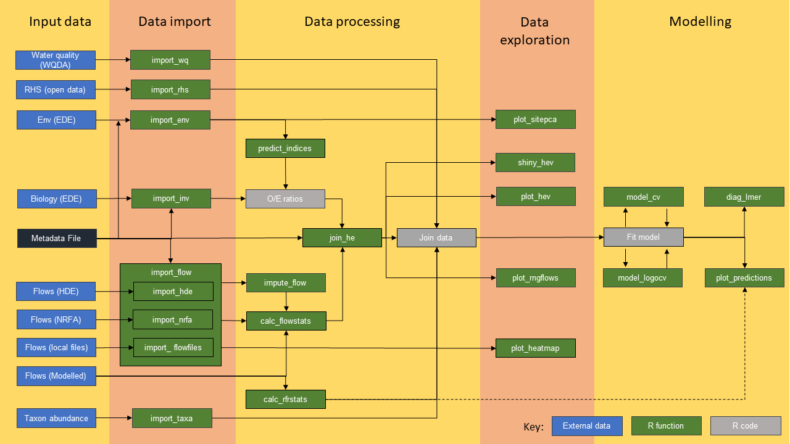

<!-- README.md is generated from README.Rmd. Please edit that file -->

# hetoolkit

<!-- badges: start -->
<!-- badges: end -->

## Overview

The `hetoolkit` package comprises a collection of 22 functions for
assembling, processing, visualising and modelling hydro-ecological data.
These are:

-   `import_nrfa` for importing flow data from the National River Flow
    Archive (NRFA);
-   `import_hde` for importing flow data from the Environment Agency
    (EA) Hydrology Data Explorer (HDE);
-   `import_flowfiles` for importing flow data from local files;
-   `import_flow` for importing flow data from a mix of the above
    sources;
-   `impute_flow` for infilling missing records in daily flow time
    series for one or more sites (gauging stations) using either an
    interpolation or an equipercentile method.
-   `import_inv` for importing macroinvertebrate sampling data from the
    EA Ecology and Fish Data Explorer;
-   `import_env` for importing environmental base data from the EA
    Ecology and Fish Data Explorer;
-   `import_rhs` for importing River Habitat Survey (RHS) data from the
    EA’s Open Data portal;
-   `import_wq` for importing water quality data from the EA Water
    Quality Archive database;
-   `predict_indices` for calculating expected scores for
    macroinvertebrate indices using the RICT model (FBA 2020);
-   `calc_flowstats` and `calc_rfrstats` for calculating summary
    statistics describing historical flow conditions;
-   `join_he` for joining the above datasets;
-   `plot_heatmap` for visualising and summarising gaps in time series
    data;
-   `plot_hev` and `shiny_hev` for producing time series plots of
    biology and flow data;
-   `plot_sitepca` for summarising environmental characteristics of
    biological sampling sites;
-   `plot_rngflows` for Visualising the range of flow conditions
    experienced historically at a site;
-   `model_cv` and `model_logocv` for performing cross-validation on
    linear mixed-effects models and hierarchical generalized additive
    models;
-   `diag_lmer` for generating a variety of diagnostic plots for a
    mixed-effects regression (lmer) model; and
-   `plot_predictions` for visualising the time series predictions from
    a hydro-ecological model/

The deprecated versions of three functions are retained for
back-compatibility. These are:

-   `calc_flowstats_old`, `predict_indices_old` and `join_he_old`

## WORKFLOW

The different functions link together as shown in the flow chart below:



## Installation

To install the latest release of `hetoolkit` use the following code:

``` r
install.packages("devtools")
library(devtools)
install_github("APEM-LTD/hetoolkit")
library(hetoolkit)
```

As an alternative, the ‘remotes’ package can be used:

``` r
install.packages("remotes")
library(remotes)
remotes::install_github("APEM-LTD/hetoolkit")
library(hetoolkit)
```

## Development

The `hetoolkit` package was developed by APEM LTD on behalf on the
Environment Agency. For further information please contact [Mike
Dunbar](mailto:mike.dunbar@environment-agency.gov.uk).

## Change history

<table>
<colgroup>
<col style="width: 24%" />
<col style="width: 30%" />
<col style="width: 45%" />
</colgroup>
<thead>
<tr class="header">
<th>Version</th>
<th>Date</th>
<th>Details</th>
</tr>
</thead>
<tbody>
<tr class="odd">
<td>1.0.0</td>
<td>May-2021</td>
<td>New release</td>
</tr>
<tr class="even">
<td>2.0.0</td>
<td>Dec-2022</td>
<td>Added new function impute_flows.<br />
Major updates to calc_flowstats, predict_indices and join_he.<br />
Bug fixes and vignette updates.</td>
</tr>
<tr class="odd">
<td>2.1.0</td>
<td>Mar-2023</td>
<td>Added new function import_wq.<br />
Minor corrections to documentation (typos, etc).</td>
</tr>
</tbody>
</table>

Full details of changes are listed below:

v2.1.0: \* New functions + New function `import_wq` added, which allows
the download and import of water quality data.

-   Bug fixes
    -   Corrections to calculations for long-term statistics in
        calc_flowstats, including adding mean, min and max flows.
    -   Fix to import_inv to resolve error if importing a formatted rds
        file.
    -   Removed tictoc package from import_env and import_rhs.

v2.0.0 \* General + Vignette updated to include new functions and
reflect other changes in v2.0.0. + Created new support pages with
guidance on installing and using the hetoolkit. + Updated and
rationalised the list of external package dependencies to speed up
installation. + Various improvements and updates to function
documentation and worked examples.

-   New functions
    -   New function `impute_flow` added, which offers three methods for
        infilling gaps in flow time series data.
-   Changes to functions
    -   Temporary .csv files downloaded by `import_hde` are now deleted
        afterwards.
    -   `import_inv` now includes an option to download
        macroinvertebrate data from Ecology and Fish Data Explorer in
        .parquet format, which is faster than .csv and has data types
        pre-formatted. This is the new default, replacing the old .csv
        file download. New argument `source` added, with options to
        automatically download data from EDE in .parquet or .csv format,
        or read in a previously saved .csv, .rds or .parquet file. The
        old `biol_dir` argument for specifying a local file is
        deprecated, but retained for backwards compatibility.
    -   `predict_indices` updated to utilise the `rict_predict` function
        from the `rict` package (<https://github.com/aquaMetrics/rict>),
        thereby eliminating the risk of divergence between the
        `hetoolkit` and `rict` packages. The former function has been
        re-named to `predict_indices_old` for backwards compatibility.
    -   `calc_flowstats` has been completely re-written to provide much
        greater flexibility for characterising antecedent flows. Rather
        than use fixed, 6-month winter and summer periods, the new
        function uses a user-defined moving window, and calculates a
        wider range of flow statistics (include statistics to quantify
        the timing, frequency and severity of high flow, low flow and
        dry events, as well as the timing and magnitude of maximum and
        minimum flows). If the required minimum number of records is not
        met, then NAs are returned. The long-term flow statistics are
        now all annual statistics (separate winter and summer statistics
        have been dropped). The former function has been re-named to
        `calc_flowstats_old` for backwards compatibility.
    -   `join_he` has been completely re-written to provide much greater
        flexibility when joining flow and biology data. It is now
        possible to: (i) join biology data to flow statistics (as well
        as join flow statistics to biology samples), (ii) join flow
        statistics that have been calculated by `calc_flowstats` for any
        moving window (not just fixed 6-month winter and summer
        periods), and (ii) join flows for any lagged time period (not
        just the summer period of the previous year and the year before
        last). The former function has been re-named to `join_he_old`
        for backwards compatibility.
    -   `model_cv` and `model_logocv` modified to support model class
        “lmerTest” (from lmerTest::lmer), in addition to “lmerMod” (from
        lme4::lmer) and “gam” (from mgcv::gam).
-   Bug fixes
    -   Fixed issue in `plot_rngflows` to prevent error when z variable
        is unspecified.
    -   Fixed issue in `plot_sitepca` to show labels when
        `plotly = TRUE`
    -   Removed deprecated function in `predict_indices`
    -   Check added to `impute_flows` to correct warning message
        appearance when donor sites specified
    -   `calc_flowstats` updated to deal with non-consecutive flow
        samples

## Examples

Further information on the functions contained within the package,
including examples, can be found in the `HE Toolkit - Vingette` at
<https://apem-ltd.github.io/hetoolkit/>.

## Reporting Bugs

If you believe you’ve found a bug in `hetoolkit`, please log an issue
(and, if possible, a reproducible example) at
<https://github.com/APEM-LTD/hetoolkit/issues>. For more feature
requests, feedback and other general queries, please contact the
`hetoolkit` development team at APEM via <hetoolkit@apemltd.co.uk>.

## Citations

To cite the hetoolkit package in publications please use:

Dunbar, M., Brown, R., Gordon, I., Gallagher, K. and Davey, A. (2023)
hetoolkit: Hydro-Ecology Toolkit, R package version 2.1.0. ;
<https://github.com/APEM-LTD/hetoolkit>

For full citation, including BibTex entry, use list(title = “hetoolkit:
Hydro-Ecology Toolkit”, author = list(list(given = “APEM-Ltd”, family =
NULL, role = c(“aut”, “cre”), email = “<A.Davey@apemltd.co.uk>”, comment
= NULL)), year = “2023”, note = “R package version 2.0.0”)

## References

FBA, 2020. River Invertebrate Classification Tool (RICT2) User Guide
V1.5 (2020) \[Online\] Available at:
<https://www.fba.org.uk/FBA/Public/Discover-and-Learn/Projects/User%20Guides.aspx>

## Licence

The R-Code included within the Hydro-Ecology Toolkit package is licensed
under GPL-V3 (see: <https://www.gnu.org/licenses/gpl-3.0.en.html>).

The Hydro-Ecology Toolkit package contains public sector information
licensed under the Open Government Licence v3.0. Licence information is
available at:
<https://www.nationalarchives.gov.uk/doc/open-government-licence/version/3/>

## Disclaimer

This software has been approved for release by the Environment Agency
(EA). Although the software has been subjected to review and testing,
the EA reserves the right to update the software as needed pursuant to
further analysis and review. No warranty, expressed or implied, is made
by the EA as to the functionality of the software and related material
nor shall the fact of release constitute any such warranty. Furthermore,
the software is released on condition that the EA shall not be held
liable for any damages resulting from its authorized or unauthorized
use.
