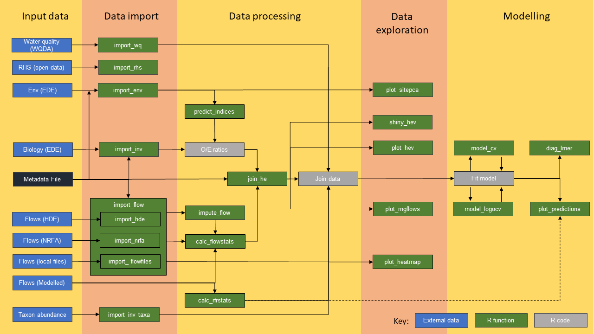

<!-- index.md is generated from index.Rmd. Please edit that file -->

```{r, include = FALSE}
knitr::opts_chunk$set(
  collapse = TRUE,
  comment = "#>",
  fig.path = "man/figures/README-",
  out.width = "100%"
)
```

# hetoolkit


## Overview 

The `hetoolkit` package comprises a collection of 23 functions, developed by APEM Ltd on behalf of the Environment Agency, to assemble, process, visualise and model hydroecological (HE) data. The full set of functions are listed under the Reference tab above. Note that they include deprecated versions of three functions that are retained for back-compatibility. 

## Background 

There is growing awareness of the need for better empirical evidence in water resources decision-making. HE modelling is an emerging field that offers the opportunity to develop statistically powerful tools to predict the ecological impacts of water resources activities, such as abstraction, by relating data on an ecological receptor to antecedent hydrological (plus other environmental) predictors. The most powerful models are those that 'pool' data from multiple sites that span the environmental gradient(s) of interest (e.g. abstraction pressure) to create a large calibration dataset, making it possible to predict the ecological impacts of changes in flow under a range of environmental conditions.  

HE modelling has various areas of intended application, from no deterioration investigations and water company drought plan environmental assessments to local flow constraint proposals. Any water company or consultant using the toolkit for an official purpose such as these should first ensure they are familiar with the relevant statutory guidance and other Environment Agency publications. They may also find the FAQs tab above helpful. 

Short of full HE model development and beyond the specific field of hydroecology, the `hetoolkit` package has various potential uses, such as collating Environment Agency monitoring data, summarising flow data and pairing environmental and ecological datasets. 

## Workflow

The different functions link together as shown in the flow chart below:



## Installation

To install the latest release of `hetoolkit` use the following code:

``` r
install.packages("remotes")
library(remotes)
remotes::install_github("APEM-LTD/hetoolkit")
library(hetoolkit)
```

As an alternative, the 'devtools' package can be used:

``` r
install.packages("devtools")
library(devtools)
install_github("APEM-LTD/hetoolkit")
library(hetoolkit)
```

It is recommended that you install `hetoolkit` into a blank project and use the `renv` package to avoid clashes with previously installed versions of dependent packages.

After running the install_github commands, you may get a message stating that some packages have a more recent version available, followed by a menu. This appears if any of the dependent packages required for the toolkit have a more recent version available than you currently have installed. Packages may be updated, however this is not required for the hetoolkit package to run. 

To skip the updates, either enter 3 in the console or simply press return. Note that if you run one of the full code blocks above all at once (ie, highlight all four lines and run them together) then this is skipped and no updates are made to the packages.

You may also get warning messages regarding unused arguments on installing the packages. These relate to arguments in function definitions that have been removed from the main body of the function but not the definition. These will be removed but in the meantime will not affect the running of the toolkit. 

## Development

The `hetoolkit` package was developed by APEM LTD on behalf on the Environment Agency. For further information please contact [the Environment Agency](mailto:mailto:hydroecologyteam@environment-agency.gov.uk).

## Change history

Version | Date     | Details
--------|----------|---------------
1.0.0   | May-2021 | New release
2.0.0   | Dec-2022 | Added new function impute_flows.\
                     Major updates to calc_flowstats, predict_indices and join_he.\
                     Bug fixes and vignette updates.
2.1.0   | Mar-2023 | Added new function import_wq.\
                     Minor corrections to documentation (typos, etc).\
                     Updates to import_rhs to bring it in line with other import functions.\
                     Minor bug fixes.
2.1.1   | May-2023 | Updates to website.\
                     Minor update to predict_indices.
2.1.2   | Jan-2024 | Added new function import_inv_taxa.\
                     Bug fix to import_rhs, minor update to import_wq.
2.1.3   | Dec-2025 | Updates to website.\
                     Update to import_wq to ensure compatibility with new WQ data API.                     
                     
Details of recent changes to the current version of the package, including website updates, are listed in the Updates tab above. 

## Help and advice

Questions about using the HE Toolkit and HE modelling more generally can be sent to the EA National Hydroecology Team (hydroecologyteam@environment-agency.gov.uk). Please also see the list of FAQs under the Articles menu above.   

## Examples

Some examples of how to use the toolkit for HE modelling can be found in the vignette and case studies, under the Articles menu above. Beyond the toolkit's core functions these illustrate a range of methods relevant to the processing and analysis of HE data, from generalised additive modelling to harmonising taxonomic data.   

## Reporting Bugs

If you believe you’ve found a bug in `hetoolkit`, please log an issue (and, if possible, a reproducible example) at https://github.com/APEM-LTD/hetoolkit/issues. For more feature requests, feedback and other general queries, please contact the `hetoolkit` development team at APEM via [hetoolkit@apemltd.co.uk](mailto:hetoolkit@apemltd.co.uk).

## Citations

To cite the hetoolkit package in publications please use:

Dunbar, M., Brown, R., Gordon, I., Gallagher, K. and Davey, A. (2023) hetoolkit: Hydro-Ecology Toolkit, R package version 2.1.0. ; https://github.com/APEM-LTD/hetoolkit

For full citation, including BibTex entry, use citation("hetoolkit").

## References

FBA, 2020. River Invertebrate Classification Tool (RICT2) User Guide V1.5 (2020) [Online] Available at: https://www.fba.org.uk/FBA/Public/Discover-and-Learn/Projects/User%20Guides.aspx

## Licence

The R-Code included within the Hydro-Ecology Toolkit package is licensed under GPL-V3 (see: https://www.gnu.org/licenses/gpl-3.0.en.html).

The Hydro-Ecology Toolkit package contains public sector information licensed under the Open Government Licence v3.0.  Licence information is available at: https://www.nationalarchives.gov.uk/doc/open-government-licence/version/3/ 

## Disclaimer

This software has been approved for release by the Environment Agency (EA). Although the software has been subjected to review and testing, the EA reserves the right to update the software as needed pursuant to further analysis and review. No warranty, expressed or implied, is made by the EA as to the functionality of the software and related material nor shall the fact of release constitute any such warranty. Furthermore, the software is released on condition that the EA shall not be held liable for any damages resulting from its authorized or unauthorized use.

