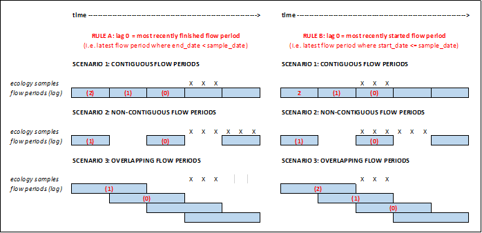

```{r setup, include=FALSE}

knitr::opts_chunk$set(echo = TRUE)

rm(list = ls())

```

# Installation

```{r load packages, message=FALSE, warning=FALSE, include=TRUE, message=FALSE, tidy=TRUE}

if(!require(pacman)) install.packages("pacman")
pacman::p_load(dplyr, insight, lubridate, readr, downloader, readxl, RCurl, writexl, tidyr, stringr, tibble, htmlTable, devtools, roxygen2, plotly, ggnewscale, ggplot2, fasstr, lme4, sjmisc, mgcv, gridExtra, ggfortify, plyr, visreg, formatR, sf, ggrepel, reshape, grid, glmmTMB, remotes, merTools, GGally, plyr)

# for development
#install.packages("devtools")
library(devtools)
devtools::load_all(export_all = FALSE)
#install_deps()
# for public version (once live)
#remotes::install_github("APEM-LTD/hetoolkit")
#library(hetoolkit)

```

# Introduction

The `hetoolkit` package comprises a collection of 20 functions for assembling, processing, visualising and modelling hydro-ecological data. These are:

* `import_nrfa` for importing flow data from the National River Flow Archive (NRFA);
* `import_hde` for importing flow data from the Environment Agency (EA) Hydrology Data Explorer (HDE);
* `import_flowfiles` for importing flow data from local files;
* `import_flow` for importing flow data from a mix of the above sources; 
* `impute_flow` for infilling missing records in daily flow time series for one or more sites (gauging stations) using either an interpolation or an equipercentile  method.
* `import_inv` for importing macroinvertebrate sampling data from the EA Ecology and Fish Data Explorer;
* `import_env` for importing environmental base data from the EA Ecology and Fish Data Explorer;
* `import_rhs` for importing River Habitat Survey (RHS) data from the EA's Open Data portal;
* `predict_indices` for calculating expected scores for macroinvertebrate indices using the RICT model (FBA 2020);
* `calc_flowstats` and `calc_rfrstats` for calculating summary statistics describing historical flow conditions;
* `join_he` for joining the above datasets;
* `plot_heatmap` for visualising and summarising gaps in time series data;
* `plot_hev` and `shiny_hev` for producing time series plots of biology and flow data;
* `plot_sitepca` for summarising environmental characteristics of biological sampling sites;
* `plot_rngflows` for Visualising the range of flow conditions experienced historically at a site;
* `model_cv` and `model_logocv` for performing cross-validation on linear mixed-effects models and hierarchical generalized additive models;
* `diag_lmer` for generating a variety of diagnostic plots for a mixed-effects regression (lmer) model; and
* `plot_predictions` for visualising the time series predictions from a hydro-ecological model.

This vignette illustrates a typical workflow using a selection of 20 macroinvertebrate sampling sites from the Environment Agency's National Drought Monitoring Network (NDMN). 

Although the package has been developed with macroinvertebrate data in mind, the functions can be used with any kind of biological sampling data.

# Meta-data file

To link together disparate datasets requires a look-up table of site ids. In this example, we load a table with four columns:

* *biol_site_id* = id of biology (in this case macroinvertebrate) sampling site.
* *flow_site_id* = id of paired flow gauging station.
* *flow_input* = vector specifying where to source the flow data for station (either National River Flow Archive "NRFA", Hydrology Data Explorer "HDE", or local files "FLOWFILES").
* *rhs_survey_id* = id of paired River Habitat Survey (RHS) (survey id, not not site id, in case multiple surveys have been undertaken at a site).

```{r master data, message=FALSE, tidy=TRUE}

# load master file
data("master_file")

# make all columns character vectors
master_file$biol_site_id <- as.character(master_file$biol_site_id)
master_file$rhs_survey_id <- as.character(master_file$rhs_survey_id)

# filter master file for selected sites of interest
master_data <- master_file %>% filter(biol_site_id %in% c("34310", "34343", "34352", "55287", "55395", "55417", "55673", "55824", "55897", "56065", "56226", "54637", "54769", "54801", "54962", "80998", "56491", "54827", "77216", "52828"))

# view data
master_data

# get site lists, for use with functions
biolsites <- master_data$biol_site_id
flowsites <- master_data$flow_site_id
flowinputs <- master_data$flow_input
rhssurveys <- master_data$rhs_survey_id

```

## Standardised Column Names

A number of standardised column names are used throughout the `hetoolkit` package, and throughout this vignette and its associated datasets.  These include:

* *biol_site_id* = macroinvertebrate sampling site ids.
* *flow_site_id* = flow gauging station ids.
* *rhs_survey_id* = River Habitat Survey (RHS) ids (survey id, not not site id, in case multiple surveys have been undertaken at a site).
* *flow* = flow data, as downloaded using the `import_flow` function 

# Prepare biology, ENV and RHS data

## Import biology data

The `import_inv` function imports macroinvertebrate sampling data from the Environment Agency's Ecology and Fish Data Explorer. The data can either be downloaded from https://environment.data.gov.uk/ecology-fish/downloads/INV_OPEN_DATA.zip or read in from a local .csv or .rds file. The data can be optionally filtered by site ID and sample date.

Below, we use our list `biolsites` to filter the data from EDE.  

```{r bio, warning=FALSE, message=FALSE, tidy=TRUE, results=FALSE}

# Import biology data from EDE
biol_data <- import_inv(sites = biolsites, start_date = "2010-01-01", end_date = "2020-12-31")

```

```{r bio_table, warning=FALSE, message=FALSE, tidy=TRUE}

# view biol_data
biol_data

```

## Optional: Join additional biology data

If the user has additional biology data in a separate Excel file, it is possible to append this to the EDE download. The additional data must have the same column names as the EDE download file.

```{r biol_drops, message=FALSE, warning=FALSE, results=FALSE, tidy=TRUE}

# bind 2 biology data sets - one from EDE and one local file

# drop any unwanted variables/columns from the EDE download file
drops_bio <- c("SAMPLE_VERSION", "REPLICATE_CODE", "SAMPLE_TYPE", "SAMPLE_METHOD", "ANALYSIS_TYPE", "ANALYSIS_METHOD", "IS_THIRD_PARTY_DATA", "WATERBODY_TYPE")

# drop unwanted variables
biol_data2 <- biol_data[ , !(names(biol_data) %in% drops_bio)]

# read in additional biology data in csv format
biol_data_excel <- read.csv("data/biol_data_join.csv")

# format columns
biol_data_excel <- biol_data_excel %>% dplyr::mutate(biol_site_id = as.character(biol_site_id))
  
# convert to tibble format
biol_data_excel <- as_tibble(biol_data_excel)

# bind datasets
biol_data_final <- rbind(biol_data2, biol_data_excel)

```

## Import environmental data

The `import_env` function allows the user to download environmental base data from the Environment Agency's Ecology and Fish Data Explorer.

The function either: 

* downloads environmental data data from
https://environment.data.gov.uk/ecology-fish/downloads/INV_OPEN_DATA.zip  
* **or** imports it from a local .csv or .rds file

Data can be optionally filtered by site ID.

When saving, the name of rds file is hard-wired to: INV_OPEN_DATA_SITES_ALL.rds.  

If saving prior to filtering, the name of the filtered rds file is hard-wired to: INV_OPEN_DATA_SITE_F.rds.

Below, we use our list `biolsites` to filter the data from EDE.

```{r env, warning=FALSE, message=FALSE, tidy=TRUE, results=FALSE}

# Import biology data from EDE
env_data <- import_env(sites = biolsites)

```

```{r env_table, warning=FALSE, message=FALSE, tidy=TRUE}

# view env_data
env_data 

```

## Optional: Map biology sites

### Get data

First we download zipped shapefiles for our basemap, and load them in as sf objects. The zipped shapefiles are left in the users project / working directory. The England map is of EA public facing area boundaries. The additional map covering the Wales coastline comes from the ESRC UK Data Service.

```{r get_data, message=FALSE, warning=FALSE}

# link not working, zip file saved in vignette folder
#download('https://environment.data.gov.uk/UserDownloads/interactive/3d91bd0c20b74#7b1bd157a32db8aa07598172/EA_AdminBoundEAandNEpublicFaceAreas_SHP_Full.zip', #destfile = 'EA_AdminBoundEAandNEpublicFaceAreas_SHP_Full.zip')

## get Wales coastline, just because map looks silly without it
download('https://borders.ukdataservice.ac.uk/ukborders/easy_download/prebuilt/shape/Wales_ol_2001.zip', destfile = 'Wales_ol_2001.zip')

## load in the shapefiles to R objects and remove seaward parts
EA.areas <- read_sf('/vsizip/EA_AdminBoundEAandNEpublicFaceAreas_SHP_Full.zip/data/Administrative_Boundaries_Environment_Agency_and_Natural_England_Public_Face_Areas.shp')
wales <- read_sf('/vsizip/Wales_ol_2001.zip')
EA.areas.land <- EA.areas %>% dplyr::filter(seaward == 'No')

```

### Data processing

We use the environmental base data that we have downloaded from the Ecology and Fish Data Explorer using `import_env`, this gives us their NGRs. We translate the NGRs to full eastings / northings and use this to turn the base data frame into a sf point object for plotting. 

```{r processing, message=FALSE, warning=FALSE}

## translate NGRs to full easting / northing
temp.eastnorths <- osg_parse(env_data$NGR_10_FIG, coord_system = "BNG") %>% as_tibble()

## make an sf point object to plot with geom_sf but retain the easting and northing column required by geom_text_repel
env_sf <- st_as_sf(bind_cols(temp.eastnorths, env_data), coords =  c("easting", "northing"), crs = 27700, remove = FALSE) 

```

### Create the map

Finally we use ggplot with geom_sf() to plot the points and ggrepel::geom_text_repel() to plot the labels. 

```{r map, message=FALSE, warning=FALSE}
basemap <- ggplot() + geom_sf(mapping = aes(), data = EA.areas.land) + 
  geom_sf(mapping = aes(), data = wales) 

basemap + geom_sf(data = env_sf, col = "blue", size = 1.5) +
  geom_text_repel(data = env_sf, aes(x=easting, y=northing, label = biol_site_id), col = "blue") +
  coord_sf(datum = sf::st_crs(27700)) 
  
```

## Optional: Join additional environmental data

Any additional environmental data in a separate Excel file can be appended to the EDE download. The additional data must have the same column names as the EDE download file. 

```{r env_drops, warning=FALSE, message=FALSE, tidy=TRUE, results=FALSE}

# bind 2 env data sets - one from EDE and one local file

# drop any unwanted variables/columns from the download file
drops_env <- c("AGENCY_AREA", "CATCHMENT", "WATERBODY_TYPE", "WATERBODY_TYPE_DESCRIPTION", "SITE_VERSION", "NGR_10_FIG", "FULL_EASTING", "FULL_NORTHING", "BASE_DATA_DATE", "MIN_SAMPLE_DATE", "MAX_SAMPLE_DATE", "COUNT_OF_SAMPLES", "ECN_SITE", "INV", "ECN_SITE_INV")

# drop unwanted variables
env_data <- env_data[ , !(names(env_data) %in% drops_env)]

# read-in environmental data in excel format
env_data_excel <- read_excel("data/Env_Additonal_Sites.xlsx")

# format columns
env_data_excel <- env_data_excel %>% dplyr::mutate(
  biol_site_id = as.character(biol_site_id),
  WATER_BODY = as.character(WATER_BODY),
  NGR_PREFIX = as.character(NGR_PREFIX),
  EASTING = as.character(EASTING),
  NORTHING = as.character(NORTHING),
  WFD_WATERBODY_ID = as.character(WFD_WATERBODY_ID))

# convert to tibble format
env_data_excel <- as_tibble(env_data_excel)

# join datasets
env_data <- rbind(env_data, env_data_excel)

```

## Import RHS data

The `import_rhs` function allows the user to download River Habitat Survey (RHS) data from Open Data.

The function either: 

* downloads RHS data from Open Data,
https://environment.data.gov.uk/portalstg/sharing/rest/content/items/b82d3ef3750d49f6917fff02b9341d68/data 
* **or** imports it from a local xlsx or rds file.

Data can be optionally filtered by survey ID.

Downloaded raw data files (in .zip format) will be automatically removed from the working directory following completed execution of the function.

Below, we use our list `rhssurveys` to filter the downloaded data.

To enable the RHS data to be joined to the biology and flow data at a later stage, it is necessary to rename the `Survey ID` column to `rhs_survey_id`.

```{r rhs, warning=FALSE, message=FALSE, tidy=TRUE, results=FALSE}

# import RHS data from Open Data
rhs_data <- import_rhs(surveys =  rhssurveys)

# rename Survey.ID as rhs_survey_id
rhs_data <- rhs_data %>% dplyr::rename(rhs_survey_id = Survey.ID)

```

If required, unwanted variables can be dropped from the dataset.

```{r rhs_drops, warning=FALSE, message=FALSE, tidy=TRUE, results=FALSE}

# select Columns to keep
rhs_keep <- c("rhs_survey_id", "Hms.Poaching.Sub.Score", "Hms.Rsctned.Bnk.Bed.Sub.Score", "HMS.Score")

# select columns of interest 
rhs_data <- rhs_data[ , (names(rhs_data) %in% rhs_keep)]

```

```{r rhs_print, warning=FALSE, message=FALSE, tidy=TRUE}

# view rhs_data
rhs_data 

```

## Predict expected indices

The `predict_indices` function mirrors the functionality of the RICT model available on the MS Azure platform (https://gallery.azure.ai/Experiment/RICT-package-2). Specifically, it uses the environmental data downloaded from EDE to generate expected scores under minimally impacted reference conditions for 80 indices, plus probabilities for RIVPACS end-groups. No classification is undertaken.

Data validation, transformation (conversion) and predictions are done within `predict_indices` using functionality predefined in the AquaMetrics RICT package (https://github.com/aquaMetrics/rict); specifically, the 'rict_predict' function from the aquaMetrics RICT package is applied.

The `predict_indices` function can accept environmental data formatted in either of two formats, specified using the 'file_format' argument:
* "EDE" - environmental data is formatted as downloaded from the EA's Ecology Data Explorer
* "RICT" - environmental data is in the RICT template format.

To run, the following columns containing substrate composition data must not contain NAs, and must total to 100 for every site:  
 
* BOULDERS_COBBLES 
* PEBBLES_GRAVEL 
* SAND 
* SILT_CLAY  

The code below demonstrates how to summarise whether these columns contain NAs, and how to replace NAs as required. Note, this code will only run successfully if using data in the "EDE" file format.

```{r predict, warning=FALSE, message=FALSE, tidy=TRUE}

# check substrate variables for presence of NAs
env_data %>%
  dplyr::select(BOULDERS_COBBLES, PEBBLES_GRAVEL, SAND, SILT_CLAY) %>%  
  summarise_all(~sum(is.na(.)))

# replace NAs, if required
env_data$BOULDERS_COBBLES[is.na(env_data$BOULDERS_COBBLES)] <- 0

```

Now that the substrate data is complete, the expected scores can be generated.
Here, we opt to calculate all available indices - we can then filter these down at a later stage.

This is an updated version of the `predict_indices` function.  The first iteration of the function remains available, using `preict_indices_old`.

```{r predict_1, warning=FALSE, message=FALSE, tidy=TRUE}

# run predictions
predict_data <- predict_indices(env_data = env_data, 
                                file_format = "EDE", 
                                all_indices = TRUE)

# view predict_data
predict_data

# drop unwanted variables
keeps <- c("biol_site_id", "SEASON", "TL2_WHPT_ASPT_AbW_DistFam", "TL2_WHPT_NTAXA_AbW_DistFam", "TL3_LIFE_Fam_DistFam", "TL3_PSI_Fam")

predict_data <- predict_data[ , (names(predict_data) %in% keeps)]

predict_data <- predict_data %>%
  dplyr::rename(Season = SEASON) %>%
  dplyr::mutate(Season = case_when(Season == 1 ~ "Spring",
                                   Season == 2 ~ "Summer",
                                   Season == 3 ~ "Autumn"))

```


## Join Biology Data, Environmental Data, and Expected Indices

Prior to joining the biology data with other datasets, it is advisable to remove or average out any replicate or duplicate samples collected from a site within the same year and season.

```{r join bio, warning=FALSE, message=FALSE, tidy=TRUE, results=FALSE}

# average out any replicate or duplicate biology samples
biol_data <- biol_data %>%
            dplyr::group_by(biol_site_id, Year, Season) %>%
            dplyr::summarise(WHPT_ASPT = mean(WHPT_ASPT),
                      WHPT_NTAXA = mean(WHPT_N_TAXA),
                      PSI_F = mean(PSI_FAMILY_SCORE),
                      LIFE_F = mean(LIFE_FAMILY_INDEX),
                      date = mean(SAMPLE_DATE)) %>%
            dplyr::ungroup()

```

The following code demonstrates how to join the expected biology metric scores from `predict_indices` to the observed biology metric scores, using the common fields `biol_site_id` and `Season`. 

```{r join bio_1}

# join expected and observed biology metric scores, by biol_site_id and Season
biol_all <- dplyr::left_join(biol_data, predict_data, by = c("biol_site_id", "Season"))

```

Next the environmental base data are joined using the common field `biol_site_id`.

```{r join bio_2, warning=FALSE, message=FALSE, tidy=TRUE, results=FALSE}

# join ENV data, by biol_site_id
 biol_all <- dplyr::left_join(biol_all, env_data, by = "biol_site_id")

```


## Calculate O/E ratios

Now that the observed and expected biology metric scores are joined into a single data frame, O:E (Observed/Expected) ratios can be calculated.

```{r OE ratios, warning=FALSE, message=FALSE, tidy=TRUE, results=FALSE}

# WHPT-ASPT
biol_all <- biol_all %>%
  mutate(
    WHPT_ASPT_O = WHPT_ASPT,
    WHPT_ASPT_E = TL2_WHPT_ASPT_AbW_DistFam,
    WHPT_ASPT_OE = WHPT_ASPT_O / WHPT_ASPT_E,
    WHPT_NTAXA_O = WHPT_NTAXA,
    WHPT_NTAXA_E = TL2_WHPT_NTAXA_AbW_DistFam,
    WHPT_NTAXA_OE = WHPT_NTAXA_O / WHPT_NTAXA_E,
    LIFE_F_O = LIFE_F,
    LIFE_F_E = TL3_LIFE_Fam_DistFam,
    LIFE_F_OE = LIFE_F_O / LIFE_F_E,
    PSI_O = PSI_F,
    PSI_E = TL3_PSI_Fam,
    PSI_OE = PSI_O / PSI_E
  )

```

# Prepare flow data

## View Flow Data Source

The data frame nrfa.hde provides a joined dataset which illustrates which stations we believe are available on the NRFA, and which stations are available on Hydrology Data Explorer. The dataset was created in early April 2021, and may become out of date over time. 

```{r flow_source, warning=FALSE, message=FALSE, tidy=TRUE}

# view nrfa.hde
nrfa.hde

```


## Import flow data

`import_flow` is a high-level function that calls `import_nrfa`, `import_hde` and `import_flowfiles` to import data for a user-defined list of sites.

Below, we use the lists `flowsites` and `flowinputs` to specify sites for import.

```{r import flow, warning=FALSE, message=FALSE, tidy=TRUE, results=FALSE}

flow_data <- import_flow(sites = flowsites,
                inputs = flowinputs,
                start_date = "2010-01-01",
                end_date = "2019-12-31",
                dir = "data/wiski",
                skip_num = 21,
                col_order = c(1,2,3))
```

```{r import flow_print, warning=FALSE, message=FALSE, tidy=TRUE}

# view flow_data
flow_data

```

## Explore data gaps

The `plot_heatmap` function is designed to visualise and summarise gaps in time series data. 

It plots time series data for multiple sites as a tiled heatmap, and optionally produces tabular summaries of data completeness by time period and site. Although designed for application with flow time series data, it can be applied to any type of numerical data, with or without a time dimension.

In the following example, `plot_heatmap` is used to explore gaps in the time series of mean daily flows, and then to summarise how complete the data is in each month.     

```{r plot heatmap, warning=FALSE, message=FALSE, tidy=TRUE}

# generate a heatmap of mean daily flows 
a <- plot_heatmap(data = flow_data, x = "date", y = "flow_site_id", fill = "flow", dual = FALSE)
# view heatmap 
gridExtra::grid.arrange(a[[1]])
# view table of completeness statistics for each site 
a[[3]]


# uses flow_data, as produced using import_flow()
flow_data$month <- lubridate::month(flow_data$date)
flow_data$year <- lubridate::year(flow_data$date)
temp1 <- flow_data %>% 
  dplyr::group_by(month,year,flow_site_id) %>% 
  dplyr::summarise(across(.cols= "flow", list(
    mean = ~mean(flow, na.rm = TRUE), 
    missing = ~length(which(is.na(flow))), 
    total = ~length(flow), 
    perc_missing = ~(length(which(is.na(flow)))/length(flow))*100), .names = "{.fn}"))
temp1$yy_mm <- paste(temp1$year, temp1$month, sep="_")

# heatmap of monthly mean flows.
a <- plot_heatmap(data = temp1, x = "yy_mm", y = "flow_site_id", fill = "mean", dual = FALSE)
# view heatmap 
gridExtra::grid.arrange(a[[1]])

# heatmap of monthly percentage completeness of the daily flow data
a <- plot_heatmap(data = temp1, x = "yy_mm", y = "flow_site_id", fill = "perc_missing")
# view heatmap
gridExtra::grid.arrange(a[[1]])

```

## Impute flow gaps

The `impute_flow` function is designed to infill missing records in daily flow time series for one or more sites (gauging stations) using either an interpolation or an equipercentile  method. Imputation of missing flow data can improve the later estimation of flow statistics using the calc_flowstats() function and aid the visualisation of hydro-ecological relationships using the plot_hev() function.

Note, it is advisable to consult a hydrologist when doing any flow imputation, particularly if your data contains extensive/lengthy gaps.

The most straight-forward interpolation can be completed using a 'linear' or 'exponential' method. 

The output dataset is in long format, similar to that produced by `import_flow`.  The output dataset contains an 'imputed' colunm; this is a flag  indicating whether each flow value is original (0) or imputed (1).  Additionally, this function plots up observed and imputed flow values for each site; enabling the user to validate the imputation.  

Flow interpolation using the 'linear' method is demonstated below:

```{r impute flow, warning=FALSE, message=FALSE, tidy=TRUE}

flow_data_imputed <- impute_flow(flow_data, 
                                 site_col = "flow_site_id", 
                                 date_col = "date", 
                                 flow_col = "flow", 
                                 method = "linear")

```

If applying the 'equipercentile' method, an optional 'donor' argument can be specified.  The 'donor' argument must be specified in data frame format with at least two columns: the first a list of flow sites requiring imputation, and the second a list of paired donor sites. The function assumes that data for all flow sites specified within the 'donor' data table, including paired donor sites, are contained within the 'flow_data' supplied.  

If flow data for paired donor stations are not already included within the 'flow_data' dataframe, then it will be necessary to appended the donor flow data, as is demonstrated below:

```{r append donor flow, warning=FALSE, message=FALSE, tidy=TRUE}

# create 'donor' data frame
donor_mapping <- data.frame(station = ("F3105"), donor_station = ("033014"))

# get a list of donor sites
donorsites <- unique(donor_mapping$donor_station)

# download donor flow data
flow_data_donor <- import_flow(sites = donorsites,
                    inputs = "HDE",
                    start_date = "2010-01-01",
                    end_date = "2019-12-31",
                    dir = "data/wiski",
                    skip_num = 21,
                    col_order = c(1,2,3))

# append donor flow data to the original flow data
flow_data_all <- dplyr::bind_rows(flow_data, flow_data_donor)

# impute flow data using the equipercentile method
flow_data_imputed <- impute_flow(flow_data_all, 
                                 site_col = "flow_site_id", 
                                 date_col = "date", 
                                 flow_col = "flow", 
                                 method = "equipercentile",
                                 donor = donor_mapping)

```

## Calculate flow statistics

`calc_flowstats` takes a time series of measured or modelled flows and uses a user-defined moving window to calculate a suite of long-term and time-varying flow statistics flow statistics for one or more sites (stations). 

The function uses the win_start, win_width and win_step arguments to define a moving window, which divides the flow time series into a sequence  of time periods. These time periods may be contiguous, non-contiguous or overlapping. 

The sequence of time periods continues up to and including the present date, even when this extends beyond the period covered by the input flow dataset, as this facilitates the subsequent joining of flow statistics and ecology data by the `join_he` function. 

It is primarily designed to work with mean daily flows (e.g. as produced by import_flow), but can also be applied to time series data on a longer (e.g. monthly) time step. 

Regardless, the data should be regularly spaced and the same time step should be used for all sites.

This is an updated version of the `calc_flowstats` function.  The first iteration of the function, which employs fixed 6-monthly spring and autumn flow periods, remains available using `calc_flowstats_old`.

```{r calculate flow stats, warning=FALSE, message=FALSE, results=FALSE, tidy=TRUE}

# uses flow_data, as produced using import_flow()
# will also accept interpolated flow data (flow_data_imputed), as produced using impute_flow()

#  set any negative flow readings to NA
flow_data$flow[flow_data$flow <= 0] <- NA

# calculate flow statistics
flow_stats <- calc_flowstats(data = flow_data,
                           site_col = "flow_site_id",
                           date_col = "date",
                           flow_col = "flow")

```

`calc_flowstats` returns a list of two data frames. The first contains a suite of time-varying flow statistics for every 6 month winter/summer period at every site. See `?calc_flowstats` for definitions of these statistics.

```{r calculate flow stats_print, warning=FALSE, message=FALSE, tidy=TRUE}

# view time-varying flow statistics 
flow_stats[[1]]

```

The second data table contains long-term flow statistics. The data are arranged in long format, with the following columns:

* flow_site_id (a unique site id);
* season (S = summer, W = winter, A = all);
* parameter (base flow index (bfi), flow duration curve percentiles (p1 to p99), and seasonal means and standard deviations for Q5, Q10, Q20, Q25, Q30, Q50, Q70, Q75, Q80, Q90, Q95 and Q99); and
* value (calculated statistic).

```{r calculate flow stats_print2, warning=FALSE, message=FALSE, tidy=TRUE}

# view long-term flow statistics 
flow_stats[[2]]

```

## Join biology and flow data

The `join_he` function links biology data with time-varying flow statistics for one or more antecedent (lagged) time periods (as calculated by the `calc_flowstats` function) to create a combined dataset for hydro-ecological modelling. 

The function allows to user to select a method for linking biology samples to flow statistics for antecedent time periods: 
* using method = "A" (default), lag 0 is defined for each biology sample as the most recently finished flow time period; 
* using method = "B", lag 0 is defined as the most recently started flow time period. 
To describe the antecedent flow conditions prior to each biology sample, the time periods are labelled relative to the date of the biology sample, with lag 0 representing either the most recently finished (method = "A") or most recently started (method = "B") flow time period. The time period immediately prior to the Lag 0 time period is the Lag 1 period, and the period immediately prior to that is the Lag 2 period, and so on. The function allows the user to select which antecedent (lagged) time periods the biology data is joined to, e.g. lag = c(0,1,2).  This method is demonstrated in the schematic below.



The function also includes an option to specify the 'join_type':
* "add_flows" (default) produces a dataset of biological metrics (response variables) and flow statistics (predictor variables) for hydro-ecological modelling. 
* "add_biol" produces a time series of flow statistics with associated biological metrics which can be used to assess the coverage of historical flow conditions using the `plot_rngflows` function.

This is an updated version of the `join_he` function.  The first iteration of the function remains available, using `join_he_old`.
 
We will join the data for the pairs of biology and flow sites specified in `master_data`.  

```{r join HE, message=FALSE, warning=FALSE, tidy=TRUE}

# get output from calc_flowstats
flowstats_1 <- flow_stats[[1]]

# create two-column table mapping biology sites to flow sites
mapping <- master_data[, c("biol_site_id", "flow_site_id")]

# join flow statistics to biology data

join_data <- join_he(biol_data = biol_all, flow_stats = flowstats_1, mapping = mapping, lags = c(0, 1), method = "A", join_type = "add_flows")

# view join_data
join_data

```

## Join RHS data

If required, the RHS data can also be joined manually to the combined biology and flow dataset.

```{r join RHS, warning=FALSE, message=FALSE, tidy=TRUE, results=FALSE}

# create mapping
#rhs_survey_id <- as.character(rhssurveys)
#flow_site_id <- as.character(flowsites)
#mapping <- data.frame(flow_site_id, rhs_survey_id)

# create two-column table mapping biology sites to RHS surveys 
mapping <- master_data[, c("biol_site_id", "rhs_survey_id")]

# Join RHS data to join_data
all_data <- dplyr::left_join(join_data, mapping, by = 'biol_site_id')
all_data <- dplyr::left_join(all_data, rhs_data, by = 'rhs_survey_id')


```


# Exploratory data anlaysis 

## Pairwise correlations

Plotting pairwise correlations among alternative biological metrics can be useful when deciding which metric(s) to analysis. In this example, the `ggpairs` function from the `GGally` package is used to explore the distribution and correlations of four commonly used macroinvertebrate metrics. 

```{r ggpairs1, message=FALSE, warning=FALSE}

GGally::ggpairs(all_data, columns=c("LIFE_F_OE", "WHPT_ASPT_OE", "WHPT_NTAXA_OE", "PSI_OE"), 
                         upper = list(continuous = GGally::wrap("cor")),
                         diag = list(continuous = "densityDiag"),
                         lower = list(continuous = GGally::wrap("points")))

```

Similarly, a `ggpairs` plot can also be used to visualise relationships between response and predictor variables, and to identify co-linearity among predictor variables.

```{r ggpairs2, message=FALSE, warning=FALSE}

GGally::ggpairs(all_data, columns=c("LIFE_F_OE", "Q95z_lag0", "Q10z_lag0"), 
                         upper = list(continuous = GGally::wrap("cor")),
                         diag = list(continuous = "densityDiag"),
                         lower = list(continuous = GGally::wrap("points")))

```

## Assess site similarity 

Prior to building a hydro-ecological model, it is important identify any sites that could potentially be outliers because they are physically, chemically or geographically dissimilar to the others sites in the dataset. The `plot-sitepca` function performs a Principal Components Analysis (PCA) which reduces a set of site-level environmental variables down to two uncorrelated 'principal components' and plots these components as a two-dimensional scatter plot. Sites that are closer together have more similar environmental characteristics. The proportion of the total environmental variation explained by each component is indicated on the axis labels. The environmental gradients represented by the two axes can be interpreted by reference to the arrows (eigenvectors), which show the direction and strength of correlation between the principal components and the individual environmental variables.

```{r sitepca,message=FALSE, warning=FALSE}

plot_sitepca(data = env_data, vars = c("ALTITUDE", "SLOPE", "WIDTH", "DEPTH", "BOULDERS_COBBLES", "PEBBLES_GRAVEL", "SILT_CLAY"), eigenvectors = TRUE, label_by = "biol_site_id")

```

In this example, the first component (x-axis) can be interpreted as a longitudinal gradient from wider, deeper rivers (left) to smaller, steeper streams (right), and the second component (y-axis) can be interpreted a gradient in substrate composition from finer pebbles/gravels (top) to coarser boulder/cobbles (bottom). On the basis of these results, we may wish to consider whether sites such as 77216 and 55824 are suitable for inclusion in the model, or whether they are sufficiently different to warrant being excluded.

## Assess coverage of historical flow conditions

A hydro-ecological model has a greater chance of revealing relationships between biology metrics and flow variables if the biology samples span a wide range of flow conditions. Good coverage of historical flow conditions by the biology sample data also means that the calibrated model is likely to be better at predicting biological responses under high and low flow scenarios.

The `plot_rngflows` function generates a scatterplot for two flow variables and overlays two convex hulls: one showing the full range of flow conditions experienced historically, and a second convex hull showing the range of flow conditions with associated biology samples. This visualisation helps identify to what extent the available biology data span the full range of full range of flow conditions experienced historically. 

In the following example, the Q95z and Q10z flow statistics have been selected as measures of low and high flows within each six month period. The first plot shows the data for all 20 sites; the second plot is faceted to show the data separately for each site individually. In this dataset, biology samples are present for almost every six month period, and so provide excellent coverage of historical flow conditions.


```{r, rngflows1, message=FALSE, warning=FALSE}

plot_rngflows(data = all_data, flow_stats = c("Q95z_lag0", "Q10z_lag0"), biol_metric = "LIFE_F_OE", wrap_by = NULL, label = "Year")

plot_rngflows(data = all_data, flow_stats = c("Q95z_lag0", "Q10z_lag0"), biol_metric = "LIFE_F_OE", wrap_by = "biol_site_id", label = "Year")

```

## HEV plots

The `plot_hev` function generates, for one site of interest, a time series plot of biology sample data and flow summary statistics, often referred to by the EA as a hydro-ecological validation (HEV) plot. HEV plots provide a visual assessment of trends in the historical data, and an initial guide to possible relationships that could be explored and quantified within a hydro-ecological model.

Whilst the dataset outputted by the `join_he` function can be used to produce a HEV plot, a better solution is achieved by via a combination of manual processing and the `add biol` functionality of `join_he`. 


```{r hevdata, message=FALSE, warning=FALSE}

# get output from calc_flowstats
flowstats_1 <- flow_stats[[1]]

# create two-column table mapping biology sites to flow sites
mapping <- data.frame(master_data[, c("biol_site_id", "flow_site_id")])

# filter biology and flow datasets to sites of interest
biol_data_hev <- dplyr::filter(biol_all, biol_site_id %in% unique(mapping$biol_site_id))
flow_data_hev <- dplyr::filter(flowstats_1, flow_site_id %in% unique(mapping$flow_site_id))

# create a complete daily time series for each biology site
hev_data <- expand.grid(
  biol_site_id = unique(biol_data_hev$biol_site_id), 
  date = seq.Date(as.Date("2011-01-01"), as.Date("2019-12-31"), by="day"), 
  stringsAsFactors = FALSE)

# create season and water_year columns on which to join the six-monthly flow statistics
hev_data$Month <- lubridate::month(hev_data$date)
hev_data$Year <- lubridate::year(hev_data$date)

# join biology and flow data
hev_data <- hev_data %>%
  left_join(biol_data_hev, by = c("biol_site_id", "date", "Year"))

hev_data <- join_he(biol_data = hev_data, flow_stats = flow_data_hev, mapping = mapping, method = "A", join_type = "add_biol")

```

Using this new `hev_data` dataset, the following example uses `multiplot = TRUE` to produce HEV plots for four macroinvertebrate metrics at one site.

```{r hevplot1, message=FALSE, warning=FALSE}

plot_hev(data = subset(hev_data, biol_site_id == "34352"), 
         date_col = "date", 
         flow_stat = c("Q95z_lag0", "Q10z_lag0"), 
         biol_metric = c("LIFE_F_OE", "WHPT_ASPT_OE", "WHPT_NTAXA_OE", "PSI_OE"), 
         multiplot = TRUE)

```

The `save` argument can be used to export the HEV plot as a .png file. The name of the png file is fixed, however, so to generate a separate png file for each site requires a loop.

```{r hevplot2, echo=TRUE, message=FALSE, warning=FALSE, fig.show=FALSE, results=FALSE}

for(i in mapping$biol_site_id){
  
  plot_data <- subset(hev_data, biol_site_id == i)
  
  my_hev_plot <- plot_hev(data = plot_data, 
         date_col = "date", 
         flow_stat = c("Q95z_lag0", "Q10z_lag0"), 
         biol_metric = c("LIFE_F_OE"), 
         clr_by = "biol_site_id")
  
  ggsave(plot = my_hev_plot, device = "png", filename = paste0(biolsites[i],"_hevplot.png"))
  
}

```

To interactively examine time series relationships for different metrics and sites, use the `shiny_hev` function, which launches a HEV plot within a shiny app.


# Model calibration

## Model selection

Once the biology and flow data has been assembled and explored, spatial and temporal variation in a biological metric of interest can be modelled as a function of one or more flow summary statistics to reveal potential hydro-ecological relationships. For datasets comprising multiple sites, linear mixed-effects models have the ability to describe a 'global' relationship that applies across all sites, whilst also quantifying the degree of variability in this relationship from site to site. 

The following example illustrates a mixed-effects model fitted to autumn macroinvertebrate data using the `lmer` function from the `lme4` package. The model includes three variables representing high and low flows in different antecedent periods (Q95z, Q10z), and Q95z also has a random (site-specific) slope.

```{r message=FALSE, warning=FALSE}

# filter data by season
autumn_data <- all_data %>% filter(Season == "Autumn")

#filter data to eliminate NAs (necessary for cross-validation later on)
autumn_data <- autumn_data %>% filter(is.na(LIFE_F_OE) == FALSE)
autumn_data <- autumn_data %>% filter(is.na(biol_site_id) == FALSE)
autumn_data <- autumn_data %>% filter(is.na(Q95z_lag0) == FALSE)
autumn_data <- autumn_data %>% filter(is.na(Q10z_lag0) == FALSE)
autumn_data <- autumn_data %>% filter(is.na(Q95z_lag1) == FALSE)

model_full <- lme4::lmer(LIFE_F_OE ~ Q95z_lag0 + Q10z_lag0 + Q95z_lag1 + (Q95z_lag0 | biol_site_id), data = autumn_data, REML = FALSE)

summary(model_full)

```

To aid model selection, the `hetoolkit` package includes two functions for performing cross-validation.

`model_cv` performs repeated, stratified k-fold cross-validation, which can be used to evaluate a model’s ability to predict the response at sites in the calibration dataset. Alternatively, `model_logocv` performs leave-one-group-out cross-validation, which can be used to evaluate a model’s ability to predict the response at sites not in the calibration dataset. Both functions can be applied to linear mixed-effects model (class: lmerMod) or hierarchical generalized additive model (class: gam) model with a single random grouping factor. See `?model_cv` and `?model_logocv` for details.

`model_cv` and `model_logocv` measure the performance of the model under different situations, and so will not necessarily agree which is the best model. If the priority is to be able to predict the response at sites in the calibration dataset, then use `model_cv`; if the priority is to be able to predict the response at sites not in the calibration dataset, then use `model_logocv`.

In the following example, the process of simplifying the full model is guided by `model_cv`, which measures predictive performance using the Root Mean Square Error (RMSE); lower values indicate better predictions. `r` is set at 20 to give stable RMSE estimates and `control` is used to help prevent model convergence issues. Backward elimination of random-effect terms is followed by backward elimination of fixed-effect terms, until the RMSE cannot be reduced any further. `model_3` is the final, preferred model.

```{r cv1, message=FALSE, warning=FALSE, include=FALSE, results=FALSE}

my_control = lmerControl(optimizer="bobyqa", optCtrl = list(maxfun = 10000))

# start with the full model
cv_full <- model_cv(model = model_full, data = autumn_data, group = "biol_site_id", k = 5, r = 20, control = my_control)

```

```{r}

# get RMSE estimate
cv_full[1]

```

```{r cv2, echo=TRUE, message=FALSE, warning=FALSE, results=FALSE}

# drop random slope
model_1 <- model_full <- lme4::lmer(LIFE_F_OE ~ Q95z_lag0 + Q10z_lag0 + (1 | biol_site_id), data = autumn_data, REML = FALSE)

cv_1 <- model_cv(model = model_1, data = autumn_data, group = "biol_site_id", k = 5, r = 20, control = my_control)

```

```{r}

# model_1 has a higher RMSE than model_full, so keep Q95z slope
cv_1[1]

```

```{r cv3, echo=TRUE, message=FALSE, warning=FALSE, results=FALSE}

# drop Q95zLS1 term
model_2 <- model_full <- lme4::lmer(LIFE_F_OE ~ Q95z_lag0 + Q10z_lag0 + (Q95z_lag0 | biol_site_id), data = autumn_data, REML = FALSE)

cv_2 <- model_cv(model = model_2, data = autumn_data, group = "biol_site_id", k = 5, r = 20, control = my_control)

```

```{r}

# model_2 has a lower RMSE than model_full, so drop Q95zLS1
cv_2[1]

```

```{r cv4, echo=TRUE, message=FALSE, warning=FALSE, results=FALSE}

# drop Q10z term
model_3 <- model_full <- lme4::lmer(LIFE_F_OE ~ Q95z_lag0 + (Q95z_lag0 | biol_site_id), data = autumn_data, REML = FALSE)

cv_3 <- model_cv(model = model_3, data = autumn_data, group = "biol_site_id", k = 5, r = 20, control = my_control)

```

```{r}

# model_3 has a lower RMSE than model_2, so drop Q10z
cv_3[1]

# no further model simplification possible; model_3 is the final model.

```


## Model diagnostics

The `diag_lmer` function produces a variety of diagnostic plots for a mixed-effects regression (lmer) model. 

```{r message=FALSE, warning=FALSE}

# generate diagnostic plots
diag_plots <- diag_lmer(model = model_3, data = autumn_data, facet_by = NULL)

```

These include:

1. Fitted vs observed values.

```{r echo=FALSE, message=FALSE, warning=FALSE}

diag_plots[[1]]

```

2. Normal probability plot.

```{r echo=FALSE, message=FALSE, warning=FALSE}

diag_plots[[2]]

```

3.	Residuals vs fitted.

```{r echo=FALSE, message=FALSE, warning=FALSE}

diag_plots[[3]]

```

4.	Histogram of residuals.

```{r echo=FALSE, message=FALSE, warning=FALSE}

diag_plots[[4]]

```

5.	Residuals vs model fixed predictors. This displays a linear model (red) for each fixed predictor vs the model's residuals. The blue line is a loess-smoothed line. The main purpose of this plot is to check whether or not the relationship between residuals and a predictor is linear.

```{r echo=FALSE, message=FALSE, warning=FALSE}

diag_plots[[5]]

```

Alternatively, the plots can be faceted by site, to explore model fit and residuals site-by-site. In this example, the sites are arranged in descending order by the mean of the fitted values.

```{r message=FALSE, warning=FALSE, results=FALSE}

# generate diagnostic plots
diag_plots2 <- diag_lmer(model = model_3, 
                         data = autumn_data, 
                         facet_by = "biol_site_id", 
                         order_by = "mean", 
                         order = "descending", 
                         ncol = 4, 
                         scales = "fixed")

diag_plots2[[1]]
diag_plots2[[2]]
diag_plots2[[3]]
# boxplot instead of histogram of residuals:
diag_plots2[[4]]
# same as un-faceted option:
# diag_plots2[[5]]

```

Other useful diagnostic plots for `lmer` models include:

* caterpillar plots, for visualising the random intercepts and slopes for each site:

```{r message=FALSE, warning=FALSE}

sjPlot::plot_model(model = model_3, 
                   type = "re", 
                   facet.grid = FALSE, 
                   free.scale = FALSE, 
                   title = NULL, 
                   vline.color = "darkgrey") + 
  ylim(-0.2,0.2)

```

* partial regression plot for a fixed effect, showing the 'global' relationship:

```{r message=FALSE, warning=FALSE}

visreg::visreg(model_3, "Q95z_lag0", ylab = "LIFE_F_OE")
       
```

* partial regression plot for a random effect, showing the site-specific relationship:

```{r message=FALSE, warning=FALSE}

visreg::visreg(model_2, "Q95z_lag0", by = "biol_site_id", ylab = "LIFE_F_OE")

```

## Predictions

The `plot_predictions` function produces a time series plot of predictions from a hydro-ecological model, alongside observed biology and flow data. The plot is faceted by site, as specified by the `site_col` argument. The function generates a ggplot object, which can optionally be saved as a .png file named "Predictions_Plot.png".

```{r  message=FALSE, warning=FALSE}

# Generate prediction intervals
pi <- merTools::predictInterval(merMod = model_3, 
                                level = 0.95, 
                                n.sims = 1000,
                                stat = "mean",
                                type="linear.prediction",
                                include.resid.var = TRUE)

# bind to model calibration dataset
autumn_data <- cbind(autumn_data, pi)

# produce predictions plot
plot_predictions(data = autumn_data,
                  biol_metric = "LIFE_F_OE",
                  time_col = "Year",
                  site_col = "biol_site_id",
                  flow_stat = c("Q95z_lag0", "Q10z_lag0"),
                  pred_col = c("fit", "lwr", "upr"),
                  ncol = 4)

```

